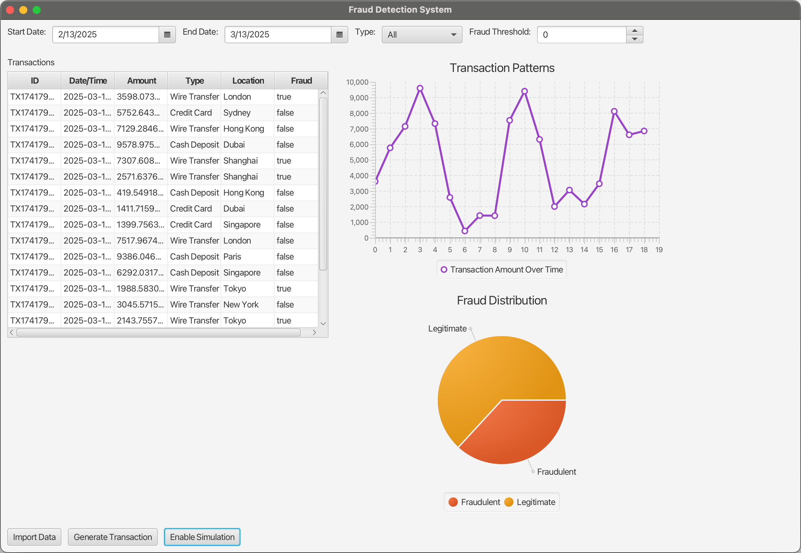

# Fraud Detection System

A real-time fraud detection system that runs entirely locally on your machine. This system simulates transaction processing and uses machine learning (Weka) to detect potentially fraudulent transactions.

## Features

- Real-time transaction simulation
- Machine learning-based fraud detection using Weka
- JavaFX-based user interface for monitoring transactions
- Local execution without external dependencies
- Stylized UI with modern design

## Dashboard Interface



The system features a comprehensive dashboard that includes:

- Date range selection for transaction filtering
- Transaction type filtering
- Adjustable fraud threshold settings
- Real-time transaction table with detailed information
- Interactive transaction patterns graph showing amount trends over time
- Fraud distribution pie chart displaying legitimate vs fraudulent transaction ratios
- Action buttons for importing data, generating transactions, and enabling simulation

## Prerequisites

- Java 17 or later
- Maven 3.6 or later

## Building the Project

To build the project, run:

```bash
mvn clean package
```

## Running the Application

After building, you can run the application using:

```bash
./run.sh
```

## How it Works

1. The system generates random transactions with varying amounts, merchants, and locations
2. Each transaction is processed through a machine learning model (Random Forest)
3. Transactions are classified as either legitimate or fraudulent
4. Results are displayed in real-time in the UI
5. The UI shows the last 100 transactions for performance

## Project Structure

- `src/main/java/com/frauddetection/`
  - `model/` - Data models and entity classes
  - `service/` - Business logic and fraud detection services
  - `ui/` - JavaFX user interface components and controllers
  - `FraudDetectionApp.java` - Main application class
- `src/main/resources/`
  - `styles/` - CSS stylesheets for the JavaFX UI

## Machine Learning Model

The fraud detection model uses the following features:
- Transaction amount
- Merchant ID
- Location

The model is pre-trained with some sample data for demonstration purposes. In a real application, you would want to train it with actual historical transaction data.

## License

This project is licensed under the MIT License - see the LICENSE file for details. 

## Contact

For questions, suggestions, or just to say hi:

- Create an issue in this repository
- Email: javian.ng.z.h@gmail.com
- GitHub: @javianng
- LinkedIn: https://www.linkedin.com/in/javianngzh/
